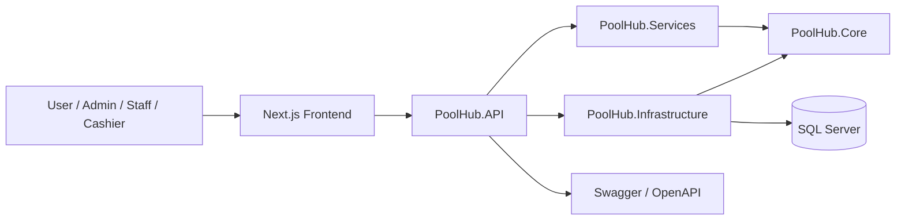

# PoolHub System Architecture

## 1. Tổng quan kiến trúc
Hệ thống hiện đi theo mô hình layered architecture cho cả backend và frontend.

## 2. Backend layers
- `PoolHub.API`: controllers, middleware, auth, swagger, rate limiting, static files.
- `PoolHub.Services`: nghiệp vụ theo module như Auth, Booking, Session, Invoice, Order, Product, Venue, Users, Dashboard.
- `PoolHub.Infrastructure`: DbContext, EF Core configurations, migrations, repositories, seed.
- `PoolHub.Core`: entities, DTOs, enums, service contracts.
- `PoolHub.Shared`: `ApiResponse`, exceptions, constants, extensions.

## 3. Luồng dữ liệu chính
1. Frontend gọi API qua `frontend/src/lib/api/client.ts`.
2. API middleware xác thực JWT và authorize theo role.
3. Controller gọi service tương ứng.
4. Service xử lý business rules, transaction và validation.
5. Repository/DbContext truy cập SQL Server bằng EF Core.
6. DbContext tự sinh audit log cho nhiều mutation quan trọng.

## 4. Các domain module chính
- IAM: auth, users, roles, permissions, refresh token, password reset.
- Venue: floors, zones, table types, venue tables, pricing plans.
- Booking: booking calendar, public availability, confirm/cancel/no-show.
- Session: start, close with summary, transfer table.
- Sales: products, orders, invoices, payments, discounts.
- Ops: notifications, audit logs, dashboard, reports.

## 5. Điểm tích hợp frontend
Frontend đang map vào API qua các service module như `auth-service`, `dashboard-service`, `venueApi`, `bookingApi`, `sessionApi`, `orderApi`, `invoiceApi`, `productApi`, `pricingApi`, `paymentsApi`, `reportsApi`.

## 6. Kiến trúc thực tế cần lưu ý
- Code backend đã có controller/service/repository thật, không chỉ là mẫu khung.
- API contract cần bám theo controller hiện tại và route chuẩn trong tài liệu.
- Nhiều feature vận hành quan trọng đã có nhưng coverage test và chuẩn hóa contract vẫn còn cần hoàn thiện.
