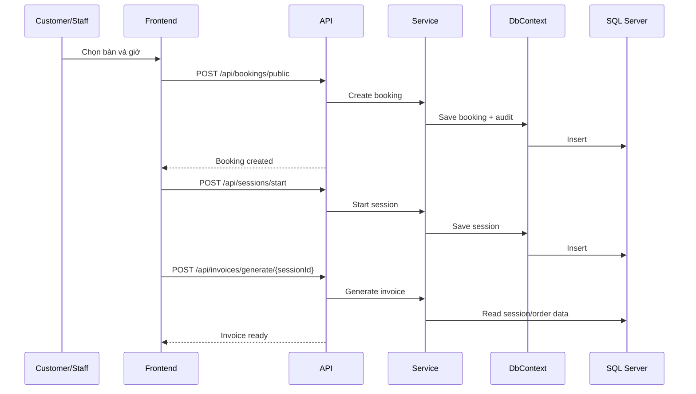

# PoolHub User Flows

## 1. Flow đăng nhập và cấp quyền
1. User gửi email/password qua `/api/auth/login`.
2. Hệ thống xác thực hash mật khẩu.
3. API trả access token, refresh token và profile có role/permission.
4. Frontend lưu token và dùng cho các request protected.

## 2. Flow đặt bàn public
1. Khách xem layout hoặc bàn khả dụng.
2. Khách chọn ngày, bàn và khung giờ.
3. Frontend gọi public availability/calendar API.
4. Gửi booking qua endpoint public.
5. Hệ thống lưu booking ở trạng thái phù hợp và trả phản hồi xác nhận.

## 3. Flow xác nhận booking tại quầy
1. Staff/Manager xem danh sách booking.
2. Chọn booking pending.
3. Gọi confirm/cancel/no-show/completed tùy trạng thái nghiệp vụ.
4. Hệ thống cập nhật booking và ghi audit.

## 4. Flow mở session và chuyển bàn
1. Staff bắt đầu session từ table hoặc booking.
2. Session được lưu với người thao tác.
3. Khi cần đổi bàn, gọi transfer table.
4. Khi kết thúc, gọi close with summary.

## 5. Flow order -> invoice -> payment
1. Tạo order gắn với session.
2. Thêm/sửa/xóa items.
3. Từ session, generate invoice.
4. Áp discount nếu có.
5. Ghi payment bằng phương thức thanh toán.
6. Có thể cancel invoice theo quy định.

## 6. Flow dashboard và báo cáo
1. Admin/Manager mở dashboard.
2. Frontend gọi summary, revenue, active sessions, low stock, recent audit logs.
3. Report APIs trả dữ liệu theo khoảng thời gian.
4. UI hiển thị theo panel nghiệp vụ.

## 7. Flow background/ops
- Booking reminder service có trong backend services.
- Audit log tự sinh khi có mutation quan trọng.
- Media upload và static files được phục vụ qua `wwwroot/uploads`.

## 8. Sequence diagram rút gọn cho booking -> session -> invoice

